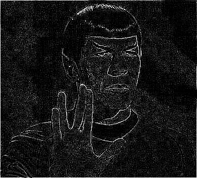
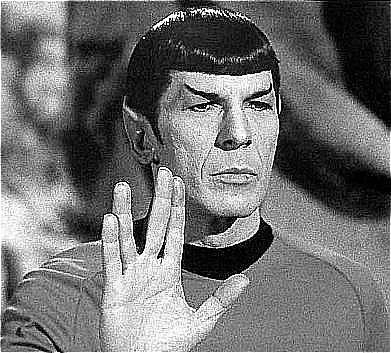
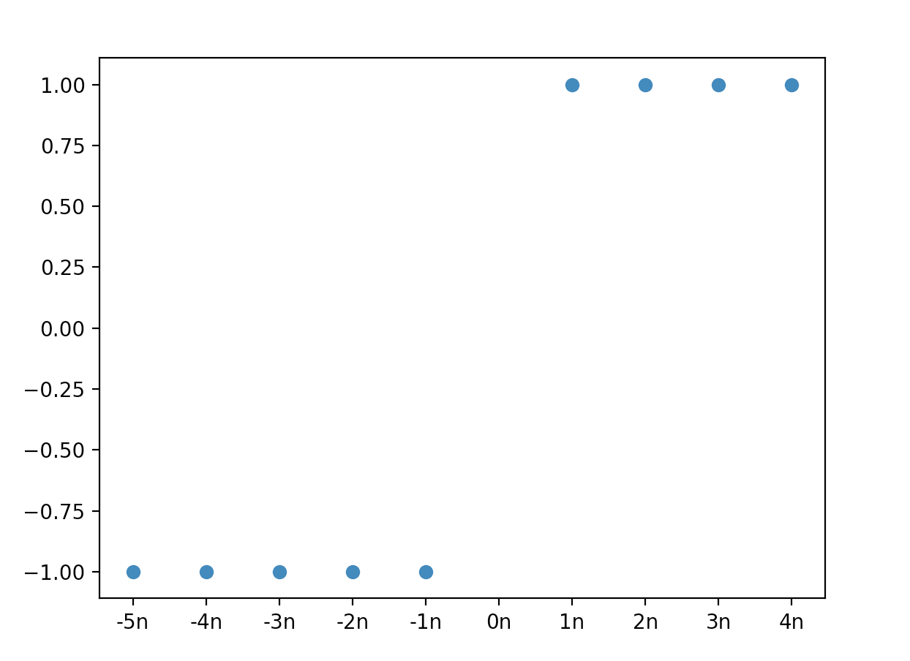
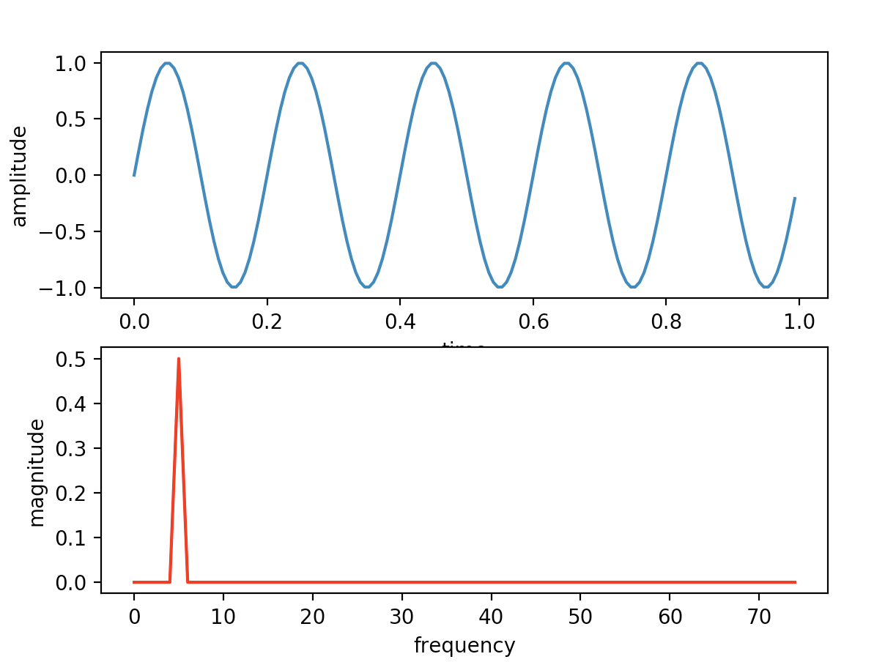
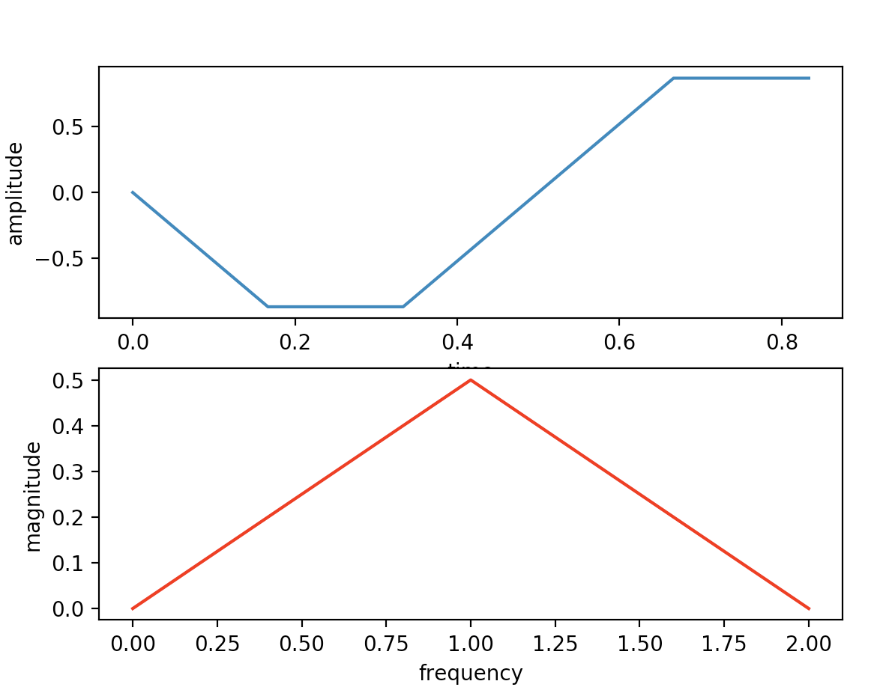
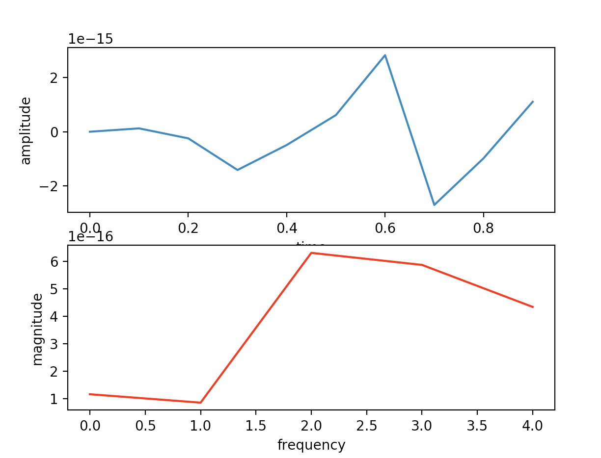

# MMN 12 Digital Image Processing

We'll apply some basic image filters by defining a kernel and performing a convolution against an image.

### Original Image


### Original GrayScale Image 
We convert the image to grayscale for simplicity. 
The grayscale image is produced with OpenCV by way of the formula `Y = 0.299 R + 0.587 G + 0.114 B`.

Color image filtering can mostly be done by splitting the image and applying the same filters to 
the individual color channels, and then recombining the image.


### Identity Filter
Convolving the image against the identity kernel results in no changes to the image. 

````
[[0, 0, 0],
 [0, 1, 0],
 [0, 0, 0]]
````

### Edge Detection Filter




The image is produced by convolving against the following kernel:

````
[[-1, -1, -1],
 [-1,  8, -1],
 [-1, -1, -1]]
````


### Sharpening Filter


The image is produced by convolving against the following kernel: 

````
[[-1, -1, -1],
 [-1, 10, -1],
 [-1, -1, -1]]
````

### Blurring Filter 


The image is produced by convolving against the following kernel: 

````
[[-1, -1, -1],
 [-1, -1, -1],
 [-1, -1, -1]]
````


## Q1

There are several edge cases.

### Intensity Constraint
Values above max or below min intensity should be handled somehow. By default we set them to the min/max intensity value.
However, it might be useful in some situations to normalize or constrain via some other distribution (also see overflow below).

### White Fading
If the kernel sum is greater than one, the average pixel values will increase after the convolution,
this will appear as an increase in the intensity of the image and will cause some image features to disappear.
We handle this by normalizing the kernel. The normalization ensures pixel intensity average is maintained.

### Black Fading
Same as white fading. 

###  Edge handling 
Convolution at image borders can wrap around, reflect, be ignored, etc. 
This should be decided on a per image or per application basis.

### Overflow
Pixel intensity values should be constrained to values between 0 and 255 - overflow should not be allowed. 
Fortunately, cv2.filter2d() handles this.


## Q2

### Q2.1

Given the tuples
`x=(4,2,3)` and `y=(2,5,1)`, we'll compute the convolution `x*y` by way of the sliding window method: 

````
x*y = (4·2, 4·5+2·1, 4·1+2·5+3·2, 2·1+3·5, 3·1) = (3, 17, 20, 24, 8)
````
We'll compare our manual calculation against Python's Numpy by running the following code: 

````
x = (4, 2, 3)
y = (2, 5, 1)

result = np.convolve(x, y)

print(result)
````

The above code outputs `[ 8 24 20 17  3]`, in line with our manual calculation. 

_NOTE_: the border handling policy is `BORDER_TRANSPARENT` (i.e a full, non-circular convolution). 

### Q2.2

#### a

Given the system

 $$y_1(n) = \frac{1}{2} x(n) + \frac{1}{2}x(n-1) $$

We'll substitute in the $\delta$ function to get the impulse response

$$ h_1(n) = \frac{1}{2} \delta (n) +  \frac{1}{2} \delta (n-1) =  \begin{cases} \frac{1}{2}, & n=0,1 \\ 0, & otherwise \end{cases}$$

We'll take take DFT transform of the impulse response to get the frequency response 

$$ H_1( \omega) = DFT( h_1(n) ) = \sum_{k=-\infty}^{\infty} h_1(k) \cdot e^{-i\cdot \omega k} =h_1(0)\cdot e^{-i\cdot \omega \cdot 0} + h_1(1) \cdot e^{-i \cdot \omega \cdot 1} = \frac{1}{2} + \frac{1}{2} \cdot e^{-i\omega}$$

#### b

Given the system

 $$y_2(n) = \frac{1}{2} x(n) - \frac{1}{2}x(n-1) $$

We'll substitute in the $\delta$ function to get the impulse response

$$ h_2(n) = \frac{1}{2} \delta (n) -  \frac{1}{2} \delta (n-1) =  \begin{cases} \frac{1}{2}, & n=0 \\ -\frac{1}{2}, & n=1 \\ 0, & otherwise \end{cases}$$

We'll take take DFT transform of the impulse response to get the frequency response 

$$ H_2( \omega) = DFT( h_2(n) ) = \sum_{k=-\infty}^{\infty} h_2(k) \cdot e^{-i\cdot \omega k} =h_2(0)\cdot e^{-i\cdot \omega \cdot 0} + h_2(1) \cdot e^{-i \cdot \omega \cdot 1} = \frac{1}{2} - \frac{1}{2} \cdot e^{-i\omega}$$

### Q2.3

By way of the frequency responses calculated in Q2.2:

$$ H_1(\omega = 0) = \frac{1}{2} + \frac{1}{2} = 1 $$

$$ H_1(\omega = \pi) = \frac{1}{2} + \frac{1}{2} \cdot e^{-i \cdot \pi} =  \frac{1}{2} -  \frac{1}{2} = 0 $$

$$ H_2(\omega = 0) = \frac{1}{2} - \frac{1}{2} = 0 $$

$$ H_2(\omega = \pi) = \frac{1}{2} - \frac{1}{2} \cdot e^{-i \cdot \pi} =  \frac{1}{2} + \frac{1}{2} = 1 $$

### Q2.4

The output of $y_1$is the average of the last two inputs. Therefore, the output signal will be smoother and blurred, which means less high frequecies - i.e $y_1$ is a Low Pass Filter. 

The output of $y_2$ is the difference of the last two inputs. Therefore, the output signal will be sharper, which means more  high frequencies - i.e $y_1$ is a High Pass Filter. 

### Q2.5

#### Thorem

Given $$ H(u,v) = e^{-(u^2+v^2)/2 \sigma^2 } $$ , then  $$ h(x,y) = \mathscr{F}^{-1}(H(u,v)) = 2 \pi \sigma^2 e^{-2 \pi^2 \sigma^2 (x^2+y^2)} $$

#### Proof

By way of equation 4.5-8 on page 226 for the Continous Inverse Fourier Transform $ \mathscr{F}^{-1} $ 

$$  h(x,y) = \mathscr{F}^{-1}(H(u,v)) =  \int_{-\infty}^{\infty}  \int_{-\infty}^{\infty}e^{-(u^2+v^2)/2 \sigma^2 } \cdot e^{i 2 \pi (ux + vz) } du \ dv $$ 

$$= \int_{-\infty}^{\infty} \left [ \int_{-\infty}^{\infty} e^{-(u^2 / 2 \sigma^2 + i 2 \pi ux} du  \right ] \ e^{-v^2/2\sigma^2 +i 2 \pi vz } dv = \mathscr{F}^{-1}( H(u) ) \cdot \mathscr{F}^{-1}( H(v) ) $$

By way of result 4.7-6 on page 265 and some further integration steps

$$ = \sqrt{2 \pi} \sigma  e^{-2 \pi^2 \sigma^2 x^2} \cdot   \sqrt{2 \pi} \sigma  e^{-2 \pi^2 \sigma^2 y^2} = 2 \pi \sigma ^2 e^{-2 \pi^2 \sigma^2 ( x^2 + y^2) } = h(x,y) $$

End of proof. 

## Q3

### Question 4.4

#### (a)

We'll notice that $2 \pi n t = 2 \pi \rightarrow t=1/n$. Therefore the period of $ f(t) = sin(2 \pi n t) $ is 1/n. 

#### (b)

The frequency of  $f(t)$ is n (one over the period).



#### (c)

_Over-sampled_ 

````
freq = 5
sample_rate = 150
````




#### (d)

_Under-sampled_

```
freq = 5
sample_rate = 6
```




#### (e)

_Critically-sampled_ 

````
freq = 5
sample_rate = 10
````




### Question 4.6

 $$ f(t) = h(t) \star \tilde{f}(t) $$

We'll notice that $H(u)$ is a square wave. We apply the IFT (eq 4.3-9) to get the spatial representation

$$h(t)= \mathscr{F}^{-1}(H(u)) = {sin( \pi t / \Delta T ) \over \pi t / \Delta T}$$

We'll also expand $\tilde{f}(t) $ by way of eq 4.3-1 

$$ \tilde{f}(t)   = \sum_{n= -\infty}^{\infty}  f(t)  \delta(t-n \Delta T) $$

We use the definition of convolution (eq 4.2-20) 

$$ f(t) = h(t) \star \tilde{f}(t) = \int_{-\infty}^{\infty} h(\tau) \tilde{f}(t-\tau) d \tau = \int_{-\infty}^{\infty} {sin( \pi \tau / \Delta T ) \over \pi \tau / \Delta T}  \cdot  \sum_{n= -\infty}^{\infty}f(t-\tau) \delta(t-\tau -n \Delta T) d\tau  $$ 

By way of the integral sum property

$$ = \sum_{n= -\infty}^{\infty} \int_{-\infty}^{\infty} {sin( \pi \tau / \Delta T ) \over \pi \tau / \Delta T}  \cdot  f(t-\tau) \delta(t-\tau -n \Delta T) d\tau $$ 

By way of eq 4.3-2 

$$ = \sum_{n= -\infty}^{\infty}  {sin( \pi (t-n \Delta T) / \Delta T ) \over \pi (t-n \Delta T) / \Delta T}  \cdot f(n \Delta T)$$ 

By way of 4.2-19

$$  = \sum_{n= -\infty}^{\infty}  sinc( { (n-\Delta T) \over \Delta T} ) \cdot f(n \Delta T) $$


## Q4

### Question 4.18

We'll use the 2-D DFT from table 4.2 on page 253

$$ F(u,v) = \sum_{x=0}^{M-1}  \sum_{y=0}^{N-1} f(x,y) e^{-i 2 \pi (ux/M + vy/N)} $$

$f(x,y) = 1 $ is given 

$$ =  \sum_{x=0}^{M-1}  \sum_{y=0}^{N-1} e^{-i 2 \pi (ux/M + vy/N)} =  \sum_{x=0}^{M-1}  \sum_{y=0}^{N-1} e^{-i 2 \pi ux/M} \cdot e^{-i 2 \pi vy/N}  $$

By way of Euler's formula

$$ =  \sum_{x=0}^{M-1}  \sum_{y=0}^{N-1} \left [ cos(2 \pi u x / M) - isin(2 \pi ux /M )  \right ] \cdot \left [ cos(2 \pi v y / N) - isin(2 \pi vy /N ) \right ] $$  

Thus, we produce the following result

$$ F(u,v) = \begin{cases} 1, & u=v=0 \\ 0, & otherwise  \end{cases} $$


### Question 4.33

We'll use the 2-D IDFT from table 4.2 on page 253

$$  f(x,y) = \sum_{x=0}^{M-1}  \sum_{y=0}^{N-1} F(u,v) e^{i 2 \pi (ux/M + vy/N)}  $$ 

The complex conjugate changes the sign of the imaginary part

$$  f_{cc}(x,y) = \sum_{x=0}^{M-1}  \sum_{y=0}^{N-1} \overline{F}(u,v) e^{i 2 \pi (ux/M + vy/N)}  =$$

$$  \sum_{x=0}^{M-1}  \sum_{y=0}^{N-1} F(u,v) e^{-i 2 \pi (ux/M + vy/N)}  = f(-x,-y)$$

$$ \Downarrow $$ 

$$ f_{cc}(x,y) = f(-x,-y)$$ 

We conclude that $ \mathscr{F}^{-1} \{  \overline{F(u,v)} \} $ produces a mirror image of the original over both axis. 


